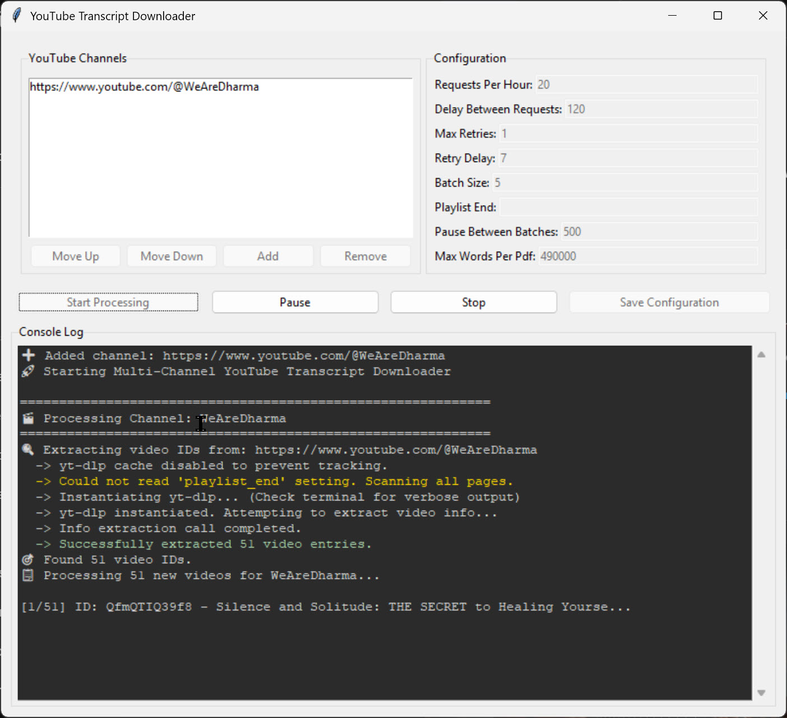

# YouTube-Transcript-Downloader

This application provides a graphical user interface (GUI) for downloading the transcripts of all videos from one or more YouTube channels. It automates the process of fetching video lists, downloading available transcripts, and compiling them into consolidated PDF files for offline use and analysis.

## Features

- **Batch Processing:** Add multiple YouTube channel URLs to the queue for sequential processing.
- **GUI Interface:** Easily manage the channel list (add, remove, reorder) and configure download settings through a user-friendly Tkinter interface.
- **PDF Compilation:** Transcripts are first saved as individual `.txt` files and then automatically merged into PDFs, with options to control the maximum word count of each PDF.
- **Configurable Settings:** Fine-tune the downloader's behavior, including requests per hour, delay between requests, max retries, and batch sizes to avoid rate-limiting.
- **Stateful Operation:** The application saves its progress, allowing you to stop and resume downloads without losing track of completed videos for each channel.
- **Process Control:** Start, pause, resume, and stop the downloading process at any time.
- **Detailed Logging:** A console log within the GUI provides real-time feedback on the downloader's status, successes, and errors.
- **Automatic Cleanup:** After successfully creating PDFs for a channel, the tool archives the raw text files and progress logs into a zip file and removes the original folders to keep the workspace clean.

## How to Use

1.  **Add Channels:** Launch the application. Use the "Add" button to input the URL of a YouTube channel. Repeat for all desired channels.
2.  **Configure:** Adjust the settings in the "Configuration" panel as needed. The default settings are generally safe for avoiding rate-limits. Click "Save Configuration" to persist settings.
3.  **Start:** Click the "Start Processing" button to begin the download queue.
4.  **Monitor:** Watch the "Console Log" for progress updates.
5.  **Manage:** Use the "Pause" and "Stop" buttons to control the process. Completed channels are marked with a checkmark.

## Dependencies

The application is built using `myc_gui.py` and requires the following key Python libraries, which are listed in `requirements.txt`:

- `youtube-transcript-api`
- `yt-dlp`
- `reportlab`
